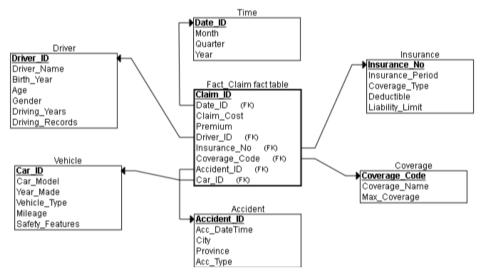
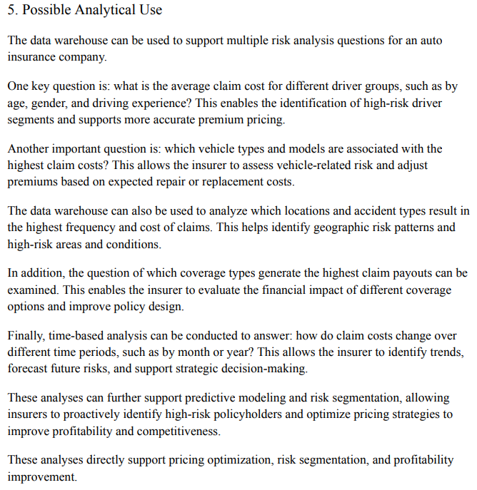

# Auto Insurance Risk Data Warehouse
This project designs a dimensional data warehouse for auto insurance risk analysis using star schema modeling, fact and dimension tables, dimensional modeling, and business intelligence concepts.

## Tools & Technologies
- Microsoft SQL Server
- ERDPlus

## Business Problem
Insurance companies require structured analytical data models to evaluate claim severity, driver risk, accident trends, coverage exposure, and profitability. This project designs a dimensional warehouse structure to support scalable reporting and business intelligence analysis.

## Project Overview
The data warehouse was designed to support analytical reporting and risk analysis for an auto insurance company. The model uses a central claim fact table connected to driver, vehicle, insurance, accident, coverage, and time dimensions to enable multidimensional analysis.

## Data Warehouse Summary
- Star schema architecture
- Central claim fact table
- Six dimension tables
- Dimensional modeling
- Structured for multidimensional analysis
- Designed to support analytical reporting

## Key Features
- Designed a dimensional star schema centered on an insurance claim fact table
- Created driver, vehicle, insurance, accident, coverage, and time dimensions
- Modeled claim cost and related insurance attributes for multidimensional analysis
- Structured the model to support driver, vehicle, geographic, accident, coverage, and time-based risk analysis
- Defined analytical use cases for claim severity, risk segmentation, pricing analysis, and profitability analysis

## Business Value
The dimensional warehouse organizes insurance claim data into a structured star schema designed to support business intelligence, executive reporting, risk segmentation, pricing analysis, and profitability analysis.

## Skills Demonstrated
- Data Warehousing
- Dimensional Modeling
- Star Schema Design
- Fact and Dimension Table Design
- Data Modeling
- Business Intelligence
- Analytical Requirements
- Microsoft SQL Server

## Data Warehouse Design

### Star Schema

### Analytical Use Cases
The dimensional model is designed to support questions such as:

- Which driver groups have the highest average claim costs?
- Which vehicle types and models are associated with higher claim costs?
- Which locations and accident types generate the highest claim frequency and severity?
- Which coverage types are associated with higher claim payouts?
- How do claim costs change across months, quarters, and years?

These analyses can support risk segmentation, pricing decisions, coverage analysis, and insurance portfolio management.

